# Relatório

## *Trabalho realizado por* 
### *- Isis Silva*
### *-Iva Martins* 
### *-Mariana Carneiro*

--- 
## **1.Apresentação do projeto** 
---

 Foi proposto para o trabalho final da disciplina de Tecnologias Web o desenvolvimento de uma página web onde inseríssemos os conteúdos lecionados nas aulas. 
   A temática escolhida pelo docente para este trabalho foi as “florestas”.  Com este tema, pensamos em criar uma página web, com o nome “De mãos dadas com a floresta”, que falasse sobre a preservação das florestas e a importância das mesmas. 
   No topo de todas páginas irá visualizar fotografias de florestas, que irão mudar entre elas, com o nome do nosso site. Existirá também um símbolo de uma árvore que acompanha toda a página mesmo que o utilizador faça scroll. No fundo de todas as páginas inserimos um footer a verde, já que achamos que combina com a temática, onde se encontram contactos de associações relacionadas com as florestas. No nosso site, como é visível colocamos um fundo que achássemos que combinaria com a temática e do resto do layout. 
  Na página inicial podemos encontrar um índice com todos os temas que iremos abordar no nosso site, como “O estado das florestas e a sua importância”, “dicas para preservar a floresta”, “florestas a visitar em Portugal”, “Alguns animais que habitam na floresta” e um formulário. Neste índice ao clicar em cada uma destas opções, irá nos levar para outra página respetivamente, através de uma hiperligação. 
   Na primeira página “O estado das florestas e a sua importância”, encontramos inicialmente informação da importância das florestas para os humanos, mais abaixo encontramos duas listas ainda sobre esta temática. 
De seguida, temos duas tabelas sobre a distribuição das áreas totais por espécies e o uso dos solos em Portugal continental, numa das tabelas inserimos também imagens. Na segunda página “Dicas para preservar as florestas”, inserimos texto com algumas dicas e mais abaixo inserimos uma lista com algumas organizações que cuidam das florestas. Na terceira página colocamos algumas florestas a visitar em Portugal, cada uma tem uma pequena descrição sobre a mesma e uma fotografia. Ao clicar na fotografia vai diretamente para o Google Maps com o respetivo endereço através de uma hiperligação. Na quarta página colocamos informação sobre alguns animais que habitam nas florestas, cada animal tem uma pequena descrição sobre o mesmo e uma fotografia. Na quinta página encontra-se um formulário, para que o utilizador possa dar a sua opinião sobre o nosso site. Caso o utilizador esteja noutra página além da página inicial e queira voltar para esta, este pode clicar no símbolo da árvore que o levará novamente para a página inicial.  

---

## **2. Interface com o utilizador** 
---

### _Sketch_ :
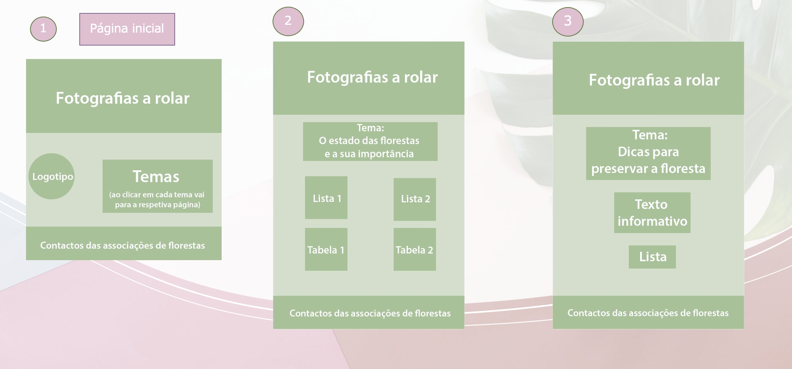
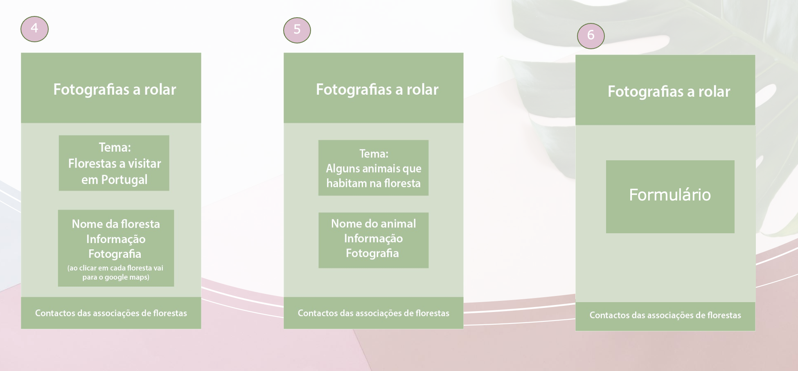

### _Sitemap_: 
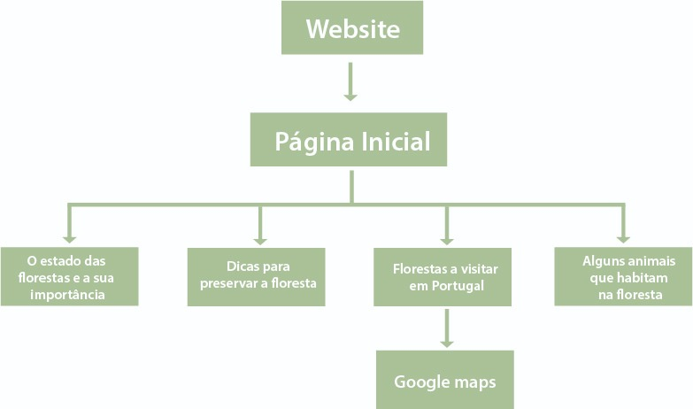

---

## **3.Produto**

### _- Descrição_:
Website sobre a preservação/dicas das florestas e a importância das mesmas.

### _- Regras de utilização_:
Não é necessário o utilizador criar uma conta.  

### _- Ajuda à navegação_:
O website é simples, sendo fácil para qualquer pessoa navegar a vontade pelo mesmo. Inserimos um símbolo de uma árvore que ao clicar nela volta à página inicial, tornando mais fácil a navegação no site. Ao clicar nas fotografias das florestas a visitar em Portugal , vai diretamente para o Google Maps, tornando assim mais prático a pesquisa para o utilizador.

### _-Validação do formulário_:
Usamos um tipo de formulário simples onde as pessoas possam dar a sua opinião sobre o website e nós criadores do mesmo ficar-mos a saber em que podemos melhorar.
Para responder ao formulário basta colocar o seu nome, e-mail e a respetiva crítica construtiva, no fim é so clicar em enviar.

### _-Validação do HTML E CSS_:

- HTML

#### Ao validar o HTML, deu alguns erros. Alguns conseguimos resolver, outros não. 

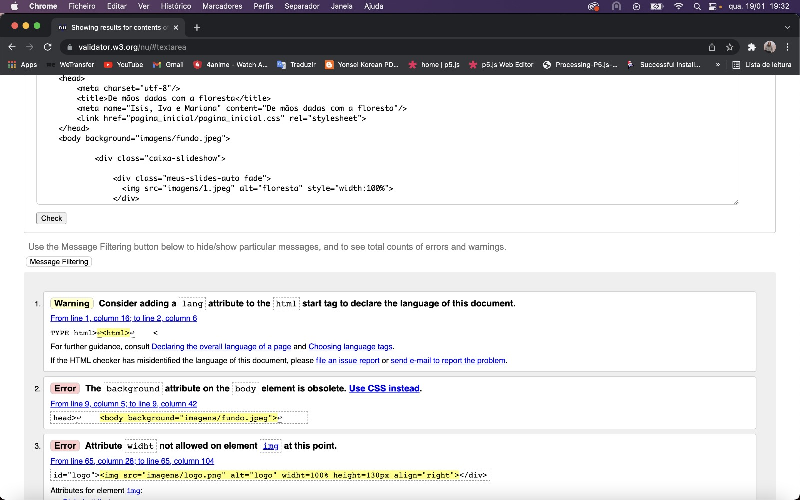
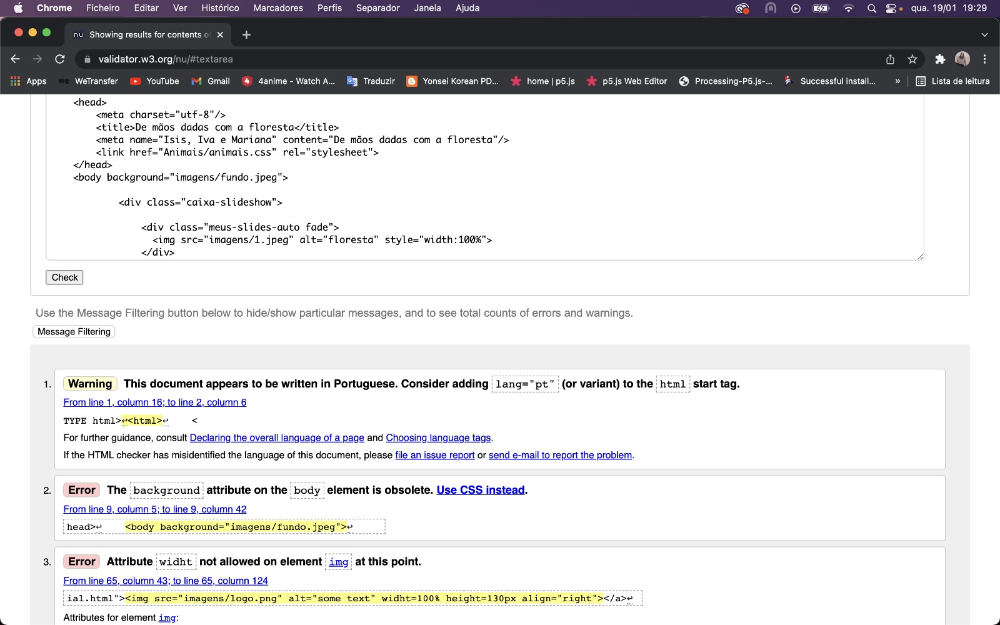
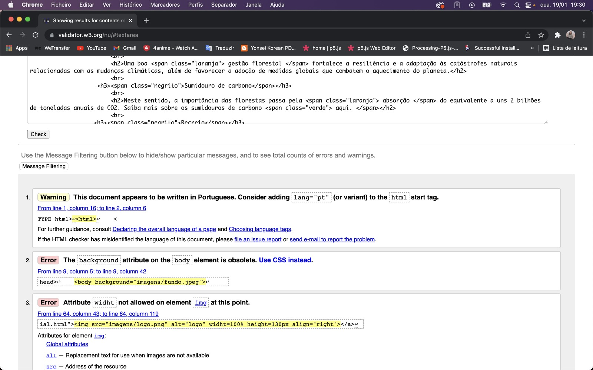
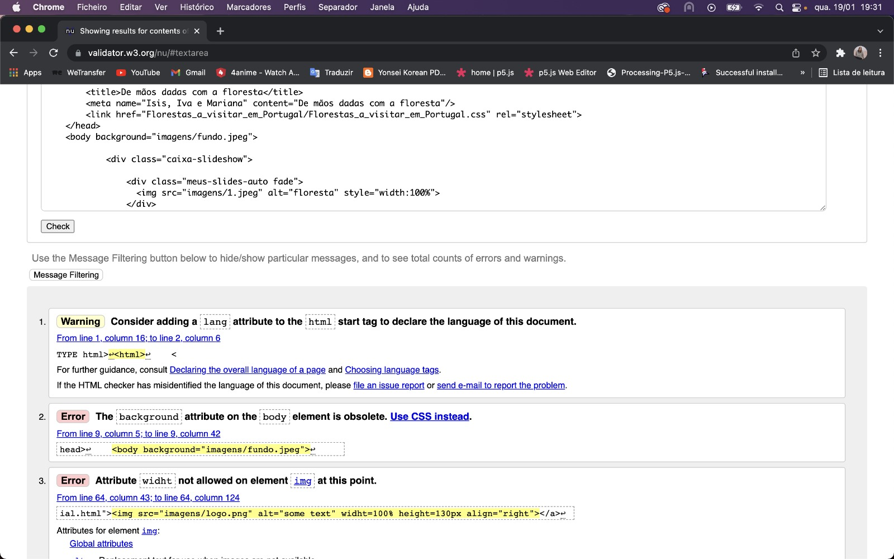
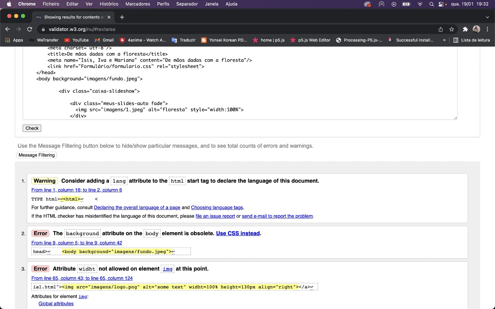
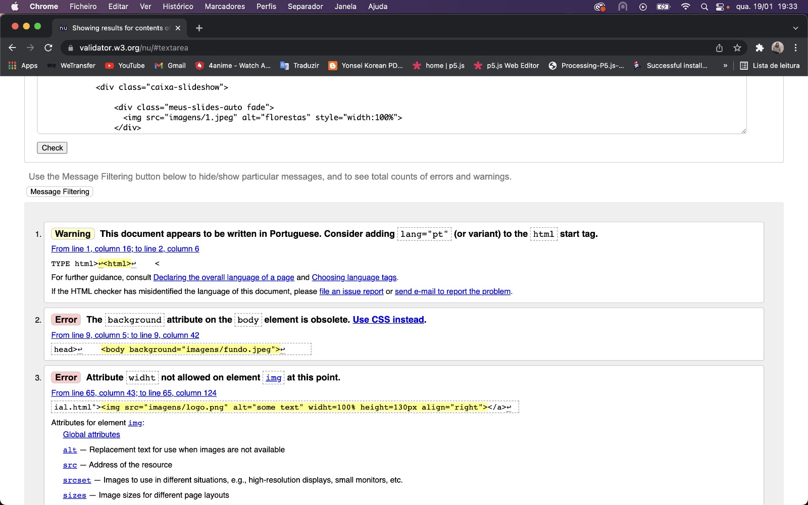

- CSS

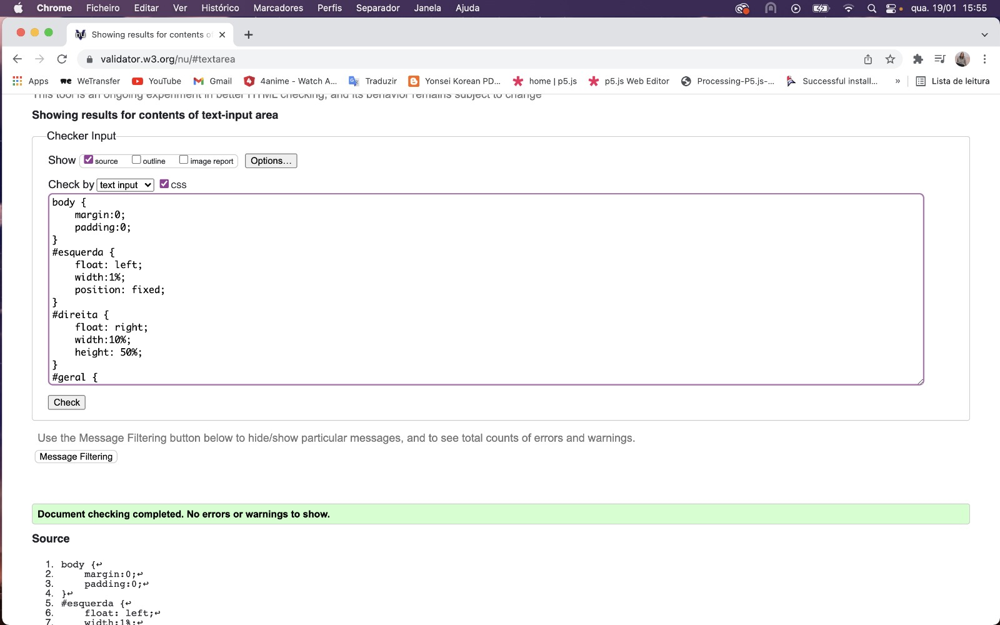
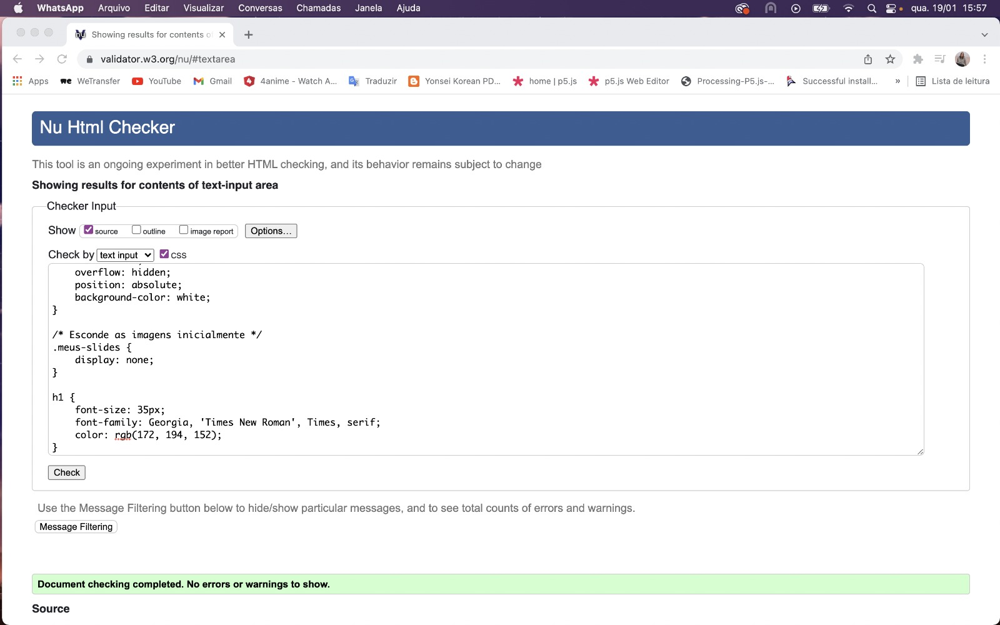
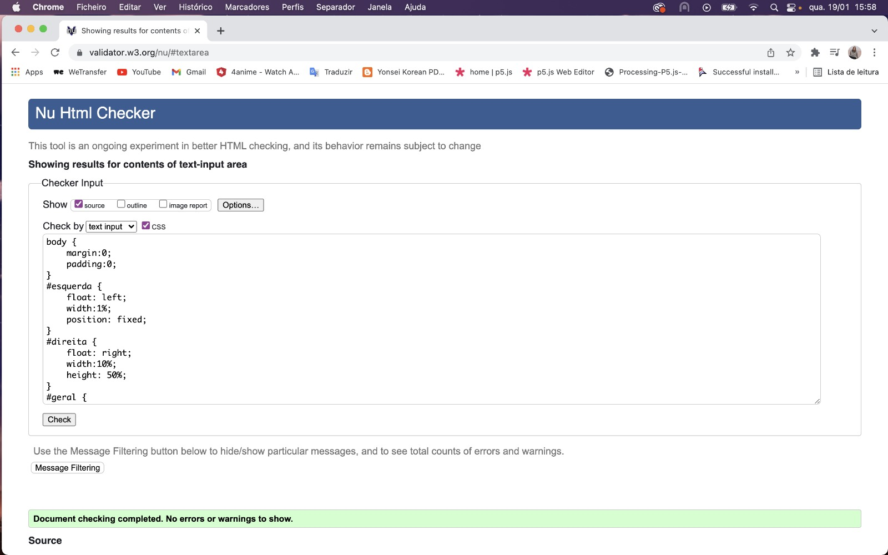

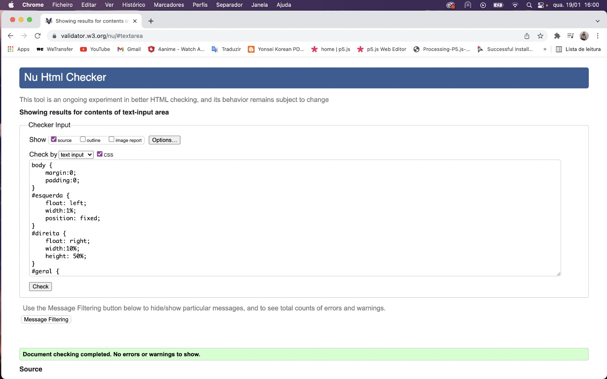

### _-Detalhes de implementação_:
Conseguimos alcançar os objetivos pedidos pelo professor. Era requerido 4 páginas estáticas e nós elaboramos 6. A utilização de Javacript não era obrigatória mas nós utilizamos para fazer as fotografias do topo do website mudarem entre si. 

___

